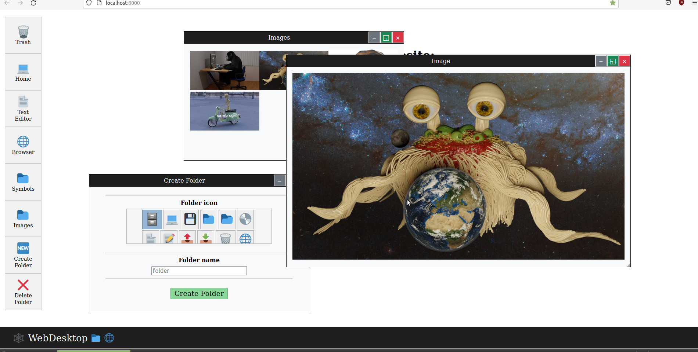

# Web-Desktop
Desktop-like styled web page

Features: 
-Drag and drop launchers and folders. 
-Open, close, minimize, grow folders. 
-Create and delete folders. 

The code in this example is different from the code in the drag and drop repo on my github page. 
Because it works a bit different it's still is a bit buggy in some situations but overal it's a fun style for a dashboard site. 

